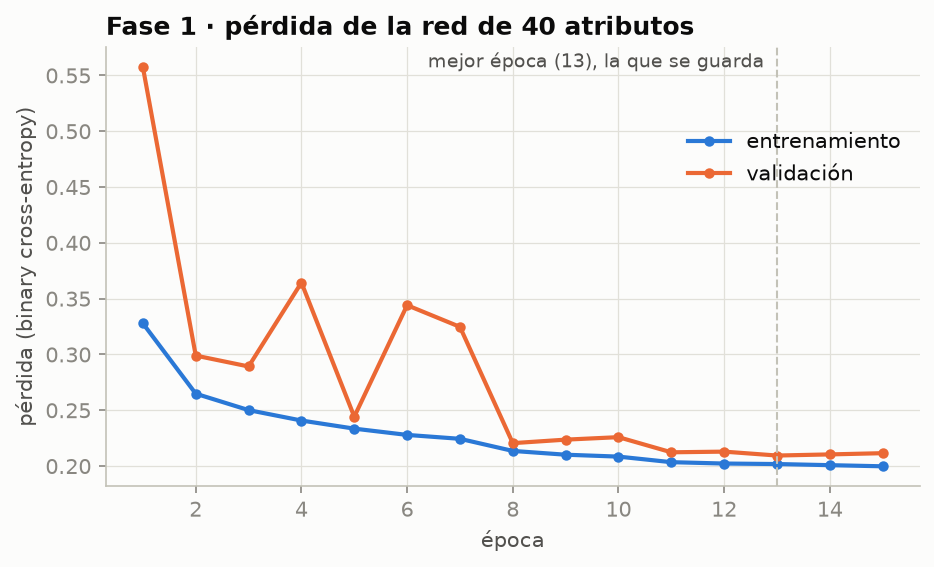
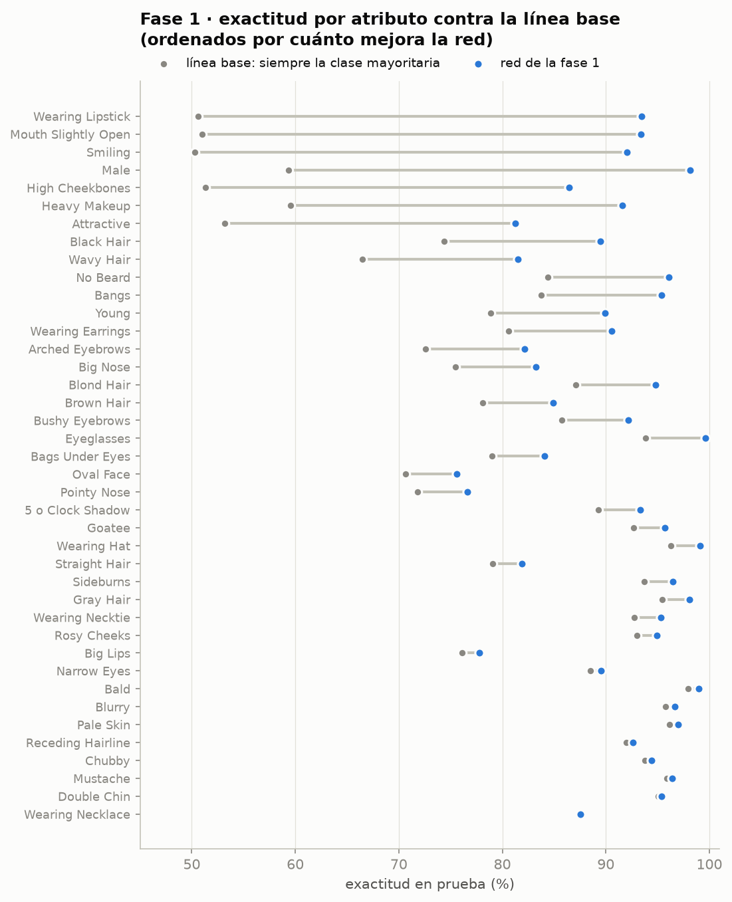
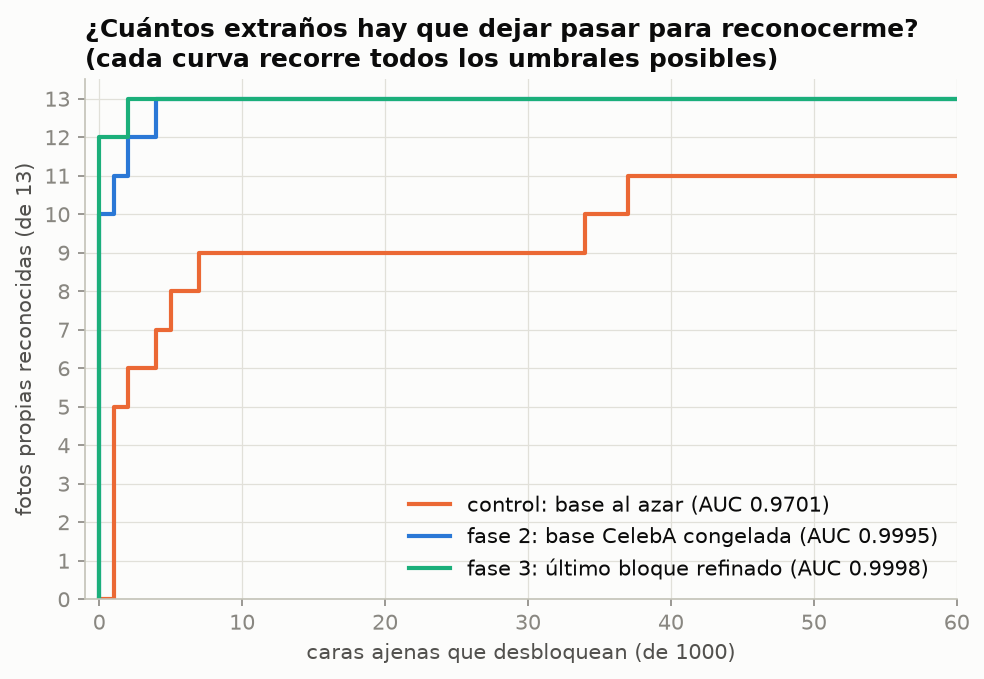
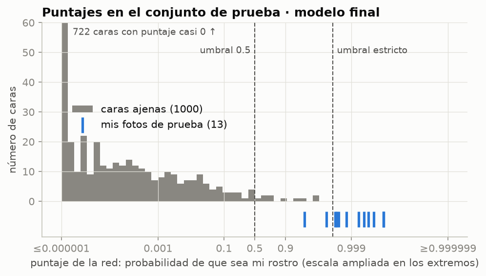

# Desbloqueo facial con transfer learning

Red neuronal que decide si una foto es **mi rostro o no**, como el desbloqueo facial de un
celular. Tengo pocas fotos mías (39 útiles), así que no alcanzan para entrenar una red
convolucional desde cero. La estrategia es **transfer learning**:

1. Se entrena una red convolucional en **CelebA** para predecir 40 atributos de rostros
   (sonrisa, lentes, barba, etc.). Así aprende a "ver caras".
2. Se toman sus capas convolucionales **sin el clasificador denso del final**.
3. Se les agrega un clasificador nuevo con **una sola neurona de salida**: ¿es mi rostro?
4. Se **congelan** las capas pre-entrenadas.
5. Se entrena ese modelo con un conjunto **equilibrado** de fotos mías y caras ajenas.

Además se siguió la estrategia de **tres entrenamientos** que sugiere el enunciado:
(a) CelebA, (b) solo el clasificador, (c) refinamiento del último bloque convolucional.

## Resultado en una línea

Con el modelo final (fase 3) y un umbral estricto elegido en validación, **de 1000 caras
ajenas no desbloquea ninguna**, y reconoce **11 de mis 13 fotos de prueba**, tomadas en
lugares y con luz que la red nunca vio al entrenar. Sin el pre-entrenamiento en CelebA, con
la misma arquitectura, no reconoce ninguna al mismo nivel de exigencia.

---

## Datos

### CelebA

Se descargó de HuggingFace ([`huggan/CelebA-faces-with-attributes`](https://huggingface.co/datasets/huggan/CelebA-faces-with-attributes)),
que no pide credenciales. Viene en 132 fragmentos parquet de 1535 imágenes cada uno; se usaron
**30 fragmentos (46 050 imágenes)** para que la fase 1 cupiera en ~1.5 h de CPU.

> **Problema encontrado:** 11 de los 132 fragmentos están truncados **en el propio
> repositorio** (00011, 00020, 00028, 00031, 00059, 00085, 00086, 00088, 00118, 00120, 00129).
> Su hash coincide con el publicado, pero les falta el pie `PAR1` del formato parquet.
> `descargar_celeba.sh` lee solo los últimos 4 bytes de cada fragmento y salta los dañados.

### Mis fotos

39 fotos útiles en **tres sesiones en lugares distintos**:

| Sesión | Lugar | Fotos | Con rostro detectado | Uso |
|---|---|---|---|---|
| 1 | Salón con sillas azules, con y sin gorra | 33 | 26 | 21 entrenamiento, 5 validación |
| 2 | Techo gris, cámara desde abajo | 4 | 2 | prueba |
| 3 | Pared clara, luz cálida | 11 | 11 | prueba |

Las fotos **no están en el repositorio** (viven en `~/fotos-rostro/` y el `.gitignore` bloquea
cualquier `.jpg`/`.heic`). Las 9 descartadas tienen la cabeza muy girada o inclinada: el
detector frontal no las encuentra, igual que un desbloqueo real no funciona de perfil.

**¿Por qué se separa por sesión?** Si la prueba fuera con fotos de la misma sesión que el
entrenamiento, bastaría con reconocer el fondo azul o la luz del salón y el resultado saldría
inflado. Con la prueba en otros lugares se mide si reconoce **la cara**.

### Mismo recorte para las dos fuentes

CelebA viene alineado y recortado; mis fotos no. Si cada fuente tuviera su propio encuadre, la
red podría aprender a distinguir "encuadre de CelebA" contra "encuadre de selfie" en vez de
"mi cara" contra "otra cara". Por eso **las dos pasan por el mismo detector** (Haar frontal de
OpenCV) y el mismo recorte (`recorte.py`): el rostro más grande, ampliado 30 % y reducido a
64×64. En CelebA el detector no encuentra rostro en el 5.4 % de las imágenes; se descartan y
quedan **43 582**.

### Separación de CelebA

Los últimos 3 fragmentos (**4 328 caras**) se reservan y **la fase 1 nunca los ve**. De ahí
salen las caras ajenas de las fases 2 y 3: así los "no soy yo" son caras que la red base no
conoce, como las de un extraño frente a mi celular. El resto (39 254) se divide 90/5/5 en
entrenamiento, validación y prueba de la fase 1.

---

## Fase 1 · Red de 40 atributos

`fase1_atributos.py`

- **Arquitectura:** 4 bloques convolucionales (32-64-128-256 filtros; cada bloque tiene
  dos convoluciones 3×3 con BatchNormalization y un MaxPooling), promedio global,
  densa de 256 con Dropout 0.3 y **40 salidas sigmoide**. 1 251 208 parámetros.
- **Pérdida:** `binary_crossentropy`, porque es **multi-etiqueta**: cada atributo es
  independiente (una cara puede estar sonriendo y tener lentes a la vez), no es una softmax.
- **Promedio global en vez de Flatten:** deja un vector de 256 rasgos que no depende de la
  posición exacta de la cara, útil porque mis fotos no quedan tan centradas como CelebA.
- **Entrenamiento:** Adam 1e-3, lotes de 128, espejo horizontal al azar, reducción de la tasa
  en meseta y parada temprana. 15 épocas, ~6 min cada una; se guardó la época 13.



**Resultado en prueba: 90.84 % de exactitud media por atributo.**

Ese número solo no dice mucho: muchos atributos están muy desequilibrados. "Bald" (calvo) es
positivo en el 2 % de las caras, así que decir siempre "no" ya da 98 %. Por eso cada
atributo se compara con una **línea base que siempre responde la clase mayoritaria**, que en
promedio da **80.23 %**.



- **Lo que mejor aprendió** son los atributos donde adivinar da ~50 %: labial, boca
  entreabierta, sonrisa y sexo (92-98 %).
- **Lo que casi no aprendió:** collar, papada, bigote y "chubby". La red acierta más del 87 %,
  pero apenas le gana a la línea base. Una explicación probable (no comprobada) es que a 64×64
  esos detalles ocupan pocos píxeles, y el collar muchas veces queda fuera del recorte.

---

## Fase 2 · Clasificador "¿es mi rostro?" sobre la base congelada

`fase2_clasificador.py`

Se construye un modelo nuevo con las capas de la red de atributos hasta `bloque4_pool`
(**sin el clasificador denso**), se **congelan** y se les agrega:

```
promedio global → Dense(128, relu) → Dropout(0.5) → Dense(1, sigmoid)
```

Solo se entrenan **33 025 parámetros**; los 1 175 136 de la base quedan fijos.

### Conjunto equilibrado

| | Positivos (yo) | Negativos (CelebA reservado) |
|---|---|---|
| Entrenamiento | 3 028 variaciones de 21 fotos | 3 028 |
| Validación | 300 variaciones de 5 fotos | 300 |
| Prueba | 13 fotos **sin aumentar**, sesiones 2 y 3 | 1 000 |

Las variaciones se generan con `ImageDataGenerator` (rotación ±15°, desplazamiento, zoom,
brillo 0.6-1.4, cambio de color, espejo). Dos cuidados:

- **Las caras ajenas reciben el mismo aumento.** Si solo se aumentaran mis fotos, la red podría
  aprender "imagen rotada o con bordes estirados = yo" en lugar de mirar la cara.
- **La separación es por foto original y antes de aumentar.** Si una foto y sus variaciones
  cayeran unas en entrenamiento y otras en prueba, la prueba saldría inflada.

### Control: la misma red con pesos al azar

Para saber cuánto aporta el pre-entrenamiento, se entrenó el mismo clasificador sobre la misma
arquitectura pero con **pesos convolucionales al azar** (también congelados). Al principio el
límite era de 40 épocas y el control seguía mejorando al llegar ahí, lo que habría favorecido
injustamente a la base pre-entrenada. Se subió el límite a 150; el control paró solo en la
época 109.

---

## Fase 3 · Refinamiento del último bloque

`fase3_refinamiento.py`

Se parte del modelo de la fase 2 y se **descongelan las dos convoluciones del bloque 4** junto
con el clasificador (917 761 parámetros entrenables), con una tasa de aprendizaje **100 veces
menor** (1e-5) para mover los pesos pre-entrenados solo un poco. Las capas de
BatchNormalization siguen congeladas: con tan pocas fotos propias, recalcular sus estadísticas
desajustaría lo aprendido con CelebA.

---

## Evaluación

Con dos clases tan desiguales en la prueba (13 contra 1000), **la exactitud engaña**: un
modelo que siempre responde "no eres tú" acierta el 98.7 %. Se reporta en cambio cuántas caras
ajenas desbloquean y cuántas fotos mías se reconocen.

Además, en un desbloqueo **un falso positivo es mucho peor que un falso negativo**: que se
abra con la cara de otra persona es un problema de seguridad; que no me reconozca solo obliga a
intentarlo otra vez. Por eso, además del umbral 0.5, se usa un **umbral estricto**: el menor
valor que en **validación** deja fuera a todas las caras ajenas. Se elige en validación y no
en prueba para no ajustar el resultado a la prueba.

| Modelo | AUC | Umbral 0.5: mis fotos | Umbral 0.5: ajenas que pasan | Umbral estricto: mis fotos | Umbral estricto: ajenas que pasan |
|---|---|---|---|---|---|
| Control (base al azar) | 0.9701 | 11 / 13 | 54 / 1000 | 0 / 13 | 0 / 1000 |
| Fase 2 (base CelebA congelada) | 0.9995 | 13 / 13 | 22 / 1000 | 8 / 13 | 0 / 1000 |
| **Fase 3 (bloque 4 refinado)** | **0.9998** | **13 / 13** | **10 / 1000** | **11 / 13** | **0 / 1000** |



La curva recorre todos los umbrales posibles: cuanto más arriba a la izquierda, mejor. Con la
base de CelebA se reconocen las 13 fotos dejando pasar 2 caras ajenas (fase 3) o 4 (fase 2); el
control necesita dejar pasar 7 para reconocer 9 fotos y 152 para reconocer las 13.



De las 1000 caras ajenas, 722 reciben un puntaje prácticamente 0. Mis 13 fotos quedan todas
por encima de 0.97; las dos que no pasan el umbral estricto son las más cercanas a la frontera.

### Qué se concluye

1. **El pre-entrenamiento en CelebA es lo que hace funcionar el sistema.** Con la misma
   arquitectura y los mismos datos, pero pesos al azar, el control no logra separar mis fotos
   de las ajenas cuando se le exige no dejar pasar a nadie (0 de 13).
2. **El refinamiento de la fase 3 ayudó en la prueba** (de 8 a 11 fotos reconocidas con el
   umbral estricto; de 22 a 10 caras ajenas con el umbral 0.5), **pero la evidencia es
   débil**: en validación la pérdida no mejoró (0.136 contra 0.128) y la diferencia en prueba
   son 3 fotos.

### Limitaciones

- **Pocas fotos de prueba.** Con 13 fotos propias, cada foto es 7.7 puntos de exhaustividad.
  Los resultados son una estimación gruesa, no una medida precisa.
- **Los negativos son famosos de CelebA**, no personas parecidas a mí. No se probó con caras
  de familiares o amigos, que es el caso más difícil para un desbloqueo.
- **La validación sale de la misma sesión que el entrenamiento**, así que es optimista y el
  umbral estricto elegido ahí podría no ser el mejor para otros lugares.
- **Solo 64×64 y detector Haar.** Un sistema real usa más resolución, alineación por puntos
  de la cara y detección de "caras vivas" para que no se desbloquee con una foto.

---

## Cómo reproducirlo

```bash
conda create -n rna python=3.11 && conda activate rna
pip install -r requirements.txt

sh descargar_celeba.sh 30          # ~315 MB, 30 fragmentos sanos
python preparar_celeba.py          # recorta rostros y genera datos/*.npy  (~2 min)
python fase1_atributos.py          # red de 40 atributos                   (~1.5 h en CPU)

# fotos propias en ~/fotos-rostro/sesion1/, sesion2/, ...
python preparar_fotos_propias.py
python fase2_clasificador.py       # base congelada + control con pesos al azar
python fase3_refinamiento.py       # refinamiento del bloque 4
python figuras.py
```

Todo usa la semilla 42; la fase 2 se corrió dos veces y dio exactamente los mismos números.

## Estructura

| Archivo | Qué hace |
|---|---|
| `descargar_celeba.sh` | Baja los fragmentos de CelebA saltando los dañados |
| `recorte.py` | Detector y recorte de rostro común a CelebA y a mis fotos |
| `preparar_celeba.py` | Parquet → `datos/celeba_*.npy` |
| `preparar_fotos_propias.py` | Mis fotos → `datos/propias_*.npy` (fuera de git) |
| `comun.py` | Carga de CelebA y separación de la reserva |
| `fase1_atributos.py` | Fase 1: red de 40 atributos |
| `rostro.py` | Conjuntos equilibrados, aumento y métricas de las fases 2 y 3 |
| `fase2_clasificador.py` | Fase 2 y control con pesos al azar |
| `fase3_refinamiento.py` | Fase 3 |
| `figuras.py` | Figuras del README desde `resultados/*.json` |
| `modelos/` | `fase1_atributos.keras`, `fase2_rostro.keras`, `fase3_rostro.keras` |
| `resultados/` | Métricas en JSON y registros de entrenamiento |

**Entorno:** Python 3.11, TensorFlow 2.16.2, Keras 3.15.1, en una Mac Intel sin GPU.
